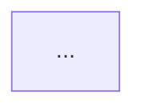

# Rumo Mermaid Diagram

Reusable workflow for **business process flowcharts** that other projects can copy:

| Deliverable | Role |
|-------------|------|
| `*.md` | Mermaid **source of truth** + short explanation tables |
| `*-preview.html` or `*-flow.html` | Interactive preview + PNG/SVG export |
| `*.png` | Documentation / delivery image (default **light** theme, 4:3) |

This skill packages the pattern used for multi-stage flows (upload → process → dual outcome branches) with engines, comparison rules, and pass/fail criteria on the diagram.

## When To Use

- User asks for a 流程图 / 业务链路图 / process diagram.
- Need both editable Mermaid and a shareable PNG.
- Need explicit branches: success vs fail, dual engines, “how to verify”, pass/fail criteria.
- Revising an existing flow: wording, theme (light/dark), remove labels, add decision rules.

Do **not** use this for arbitrary image generation (product screenshots, photos). Prefer this over freehand drawing when the flow must stay versionable in git.

## Agent Workflow

### 1. Gather content

Confirm with repo docs / user:

1. **Stages** (e.g. 上传 → 执行 → 检验 → 结果)
2. **Roles / systems** (who does what; external tools like PSModel, BPA, validator)
3. **Decision points** and **branches** (success path, reject/rework path)
4. **Pass / fail rules** if relevant (item-level vs whole-order)
5. **Theme**: default **light** (`#f7f9fc` canvas); dark only if user asks

### 2. Write Mermaid in Markdown

Create or update `docs/<name>.md` (or project-appropriate path):

````markdown
# <图标题>

简述目的与 2–4 个要点。

## 业务流程



### 说明表
...
````

**Layout rules (important):**

- Prefer **three stage columns**: `flowchart LR` + inner `direction TB` subgraphs for 一 / 二 / 三.
- Put dual outcomes as sibling subgraphs under “结果处理” (成功绿 / 失败红).
- **Avoid back-edges** that reverse rank order (e.g. fail → upload). Prefer a terminal node like `回到上传再次提交` instead of an edge that loops left.
- Use `passBranch ~~~ failBranch` (invisible link) to force success-left / fail-right when needed.
- Keep node text short; use `<br/>` for 2–4 lines max.
- Decision diamonds for yes/no; boxes for actions.
- Semantic `classDef` (light defaults):

```text
passStyle   fill:#e8f8ef stroke:#2f9e62 color:#14532d   # 通过 / 成功
failStyle   fill:#fdecec stroke:#d45454 color:#7f1d1d   # 未通过 / 驳回
engineStyle fill:#e8f1ff stroke:#3b82f6 color:#1e3a8a   # 仿真引擎 / 外部工具
compareStyle fill:#fff7e6 stroke:#d97706 color:#7c2d12  # 检验 / 对比规则
```

- Prefer product-facing names on nodes (e.g. `PSModel` not internal alias clutter).

### 3. Preview HTML

Copy `templates/flow-preview.html` into the target repo (rename as needed). Then:

1. Set page title / toolbar title / hint text.
2. Paste the same Mermaid into `#fallback-source`.
3. Point `loadSource()` at the sibling `.md` so HTTP preview always follows Markdown.
4. Default `dark = false` (light theme).

Template features already included:

- Fit / theme toggle / scale / export PNG / export SVG
- Light canvas `#f7f9fc`, dark toggle still available
- Theme-aware rewrite of `passStyle` / `failStyle` / `engineStyle` / `compareStyle`
- 1600×1200 export frame (4:3), scale 2–4×

### 4. Export PNG

Resolve `SKILL_DIR` from the directory containing this loaded `SKILL.md`. Do not derive it from a
source checkout or the target project. If the installed skill directory cannot be resolved, stop
and report the path blocker instead of guessing.

Install the declared runtime dependency once in the installed skill directory.

macOS/Linux/Git Bash/WSL:

```bash
SKILL_DIR="<installed-skill-dir>"
npm install --omit=dev --prefix "$SKILL_DIR"
```

Windows PowerShell:

```powershell
$SkillDir = "<installed-skill-dir>"
npm install --omit=dev --prefix $SkillDir
```

Then run the exporter from the **target project** so relative input and output paths belong to that
project.

macOS/Linux/Git Bash/WSL:

```bash
node "$SKILL_DIR/scripts/export-mermaid-png.mjs" \
  --html docs/<name>.html \
  --out docs/<name>.png \
  --scale 3
```

```bash
node "$SKILL_DIR/scripts/export-mermaid-png.mjs" \
  --md docs/<name>.md \
  --out docs/<name>.png \
  --title "业务流程图" \
  --scale 3
```

Windows PowerShell:

```powershell
$Exporter = Join-Path $SkillDir "scripts/export-mermaid-png.mjs"
node $Exporter `
  --html "docs\<name>.html" `
  --out "docs\<name>.png" `
  --scale 3
```

```powershell
node $Exporter `
  --md "docs\<name>.md" `
  --out "docs\<name>.png" `
  --title "业务流程图" `
  --scale 3
```

Requirements:

- Node.js 18 or later and the declared `playwright-core` dependency installed as shown above.
- Network access to jsDelivr for Mermaid + svg-pan-zoom (preview HTML CDN), **or** offline vendor copies if the project forbids CDN.
- Headless Chrome/Chromium/Edge discovered by the script, a Playwright-managed browser, or an explicit `CHROME_PATH`.

After export, **open the PNG** and check:

- Stage order left→right (or top→bottom as designed)
- Branch labels readable
- Pass (green) / fail (red) / engine (blue) / compare (amber) colors present
- No leftover internal names the user asked to remove
- Text not overflowing nodes badly

### 5. Iterate with the user

Typical revision requests and how to handle them:

| User ask | Action |
|----------|--------|
| 明亮色系 | Keep light default; re-export PNG |
| 补充如何检验 / 判定 | Expand compare + decide subgraphs + tables in MD |
| 去掉某标签 | Edit Mermaid + fallback + re-export |
| 双分支成功/失败 | Green / red subgraphs + classDef |
| 布局乱 | Remove reverse edges; simplify subgraphs; force order with `~~~` |

Always re-export PNG when Mermaid changes if the PNG is a delivered artifact.

## Deliverable Checklist

- [ ] Markdown Mermaid compiles (no syntax error in preview)
- [ ] HTML fallback matches Markdown Mermaid
- [ ] Light theme PNG regenerated at requested path
- [ ] Pass/fail or dual-branch semantics visible if the flow has outcomes
- [ ] Doc tables explain rules that do not fit on nodes
- [ ] No secrets, local absolute paths, or agent process notes in delivered docs

## File Layout (suggested per project)

```text
docs/
  <flow-name>.md      # source of truth
  <flow-name>.html    # preview + export (from templates/flow-preview.html)
  <flow-name>.png     # exported asset
```

## References

- Style and layout details: [references/style-and-layout.md](references/style-and-layout.md)
- Generic preview template: [templates/flow-preview.html](templates/flow-preview.html)
- Export CLI: [scripts/export-mermaid-png.mjs](scripts/export-mermaid-png.mjs)

## Response Discipline

- State which files were created or updated.
- State theme (light/dark) and export scale.
- If PNG export failed (no Chrome / no network), leave HTML+MD working and report the blocker with the exact command tried.
- Do not invent product rules; ground pass/fail text in repo docs or user statements.
